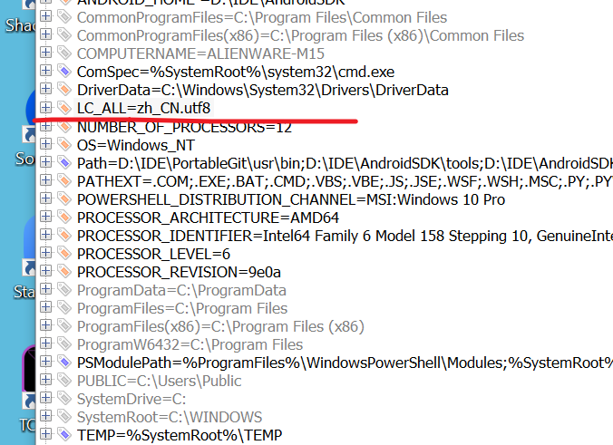

- 问题描述
  
  windows terminal中无法输入中文，输入中文显示为乱码

- 解决方案

  在系统环境变量中添加系统变量(二选一)

   ```
   LANG=zh_CN.UTF-8
   LC_ALL=zh_CN.UTF-8
   ```

- 来源
  [链接](https://answers.microsoft.com/zh-hans/windows/forum/windows_10-ime/win-10/07ca1410-cc2b-47e1-a424-c01b57dabdbe)

- 回复引用
  >
  >添加系统变量
  >
  >LANG=zh_CN.UTF-8
  >
  >LC_ALL=zh_CN.UTF-8
  >
  >其实添加其中一个就行
  > 